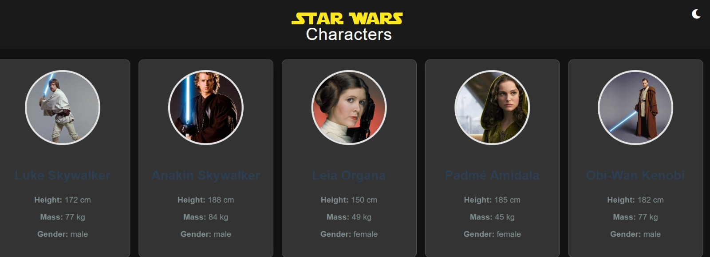

# **Star Wars Characters List**

## **Descrição**
Este projeto é uma lista interativa de personagens do universo Star Wars. Através de uma API pública, ele carrega informações sobre personagens como nome, altura, massa e gênero, exibindo-os em cartões estilizados. O projeto também oferece a opção de alternar entre o modo claro e escuro, oferecendo uma experiência de visualização mais personalizada.

## **Funcionalidades**

- **Exibição de personagens**: O projeto lista os personagens mais icônicos de Star Wars com informações detalhadas.
- **Modo escuro**: Um botão para alternar entre o modo claro e escuro para personalizar a experiência de visualização.
- **Organização personalizada**: Os personagens são exibidos em uma ordem definida previamente.

## **Estrutura do Projeto**

```bash
/star/list
  ├── src
  │   ├── css
  │   │   ├── globals.css
  │   │   └── dark-mode.css
  │   ├── fonts
  │   │   ├── starjedi/
  │   │   ├── starjout/
  │   │   ├── stjedise/
  │   │   └── stjelogo/
  │   ├── images
  │   │   ├── [imagens nos formatos jpeg, jpg, webp, ico]
  │   └── js
  │       └── script.js
  ├── index.html
  └── readme.md
```

## **Dependências**

- **Font Awesome**: Para os ícones utilizados no botão de modo escuro.
- **Fetch API**: Para buscar os dados dos personagens da API pública.

## **Como rodar o projeto**

   ```bash
   1. Clone o repo:https://github.com/RicardoVCastilho/star-wars-characters-list
   
   2. Navegue até o diretório do projeto:
   cd star-wars-characters-list

   3. Abra o arquivo index.html em um navegador de sua preferência para visualizar o projeto.
```

## **Tecnologias utilizadas**

- HTML: Estruturação do conteúdo da página.
- CSS: Estilização com um sistema de modos claro e escuro.
- JavaScript: Lógica para buscar os dados da API e interações de usuário, como o modo escuro.
- API utilizada:
Este projeto consome a API pública SWAPI, que fornece dados sobre o universo de Star Wars, incluindo personagens, planetas e naves.

## **Exemplo de funcionamento**
O projeto exibe uma lista de personagens como:

- Luke Skywalker, Anakin Skywalker, Darth Vader, Leia Organa, Obi-Wan Kenobi, dentre outros.

## **Veja você mesmo**
- Design Light Mode:


- Design Dark Mode:



- Teste pelo GitPages: https://ricardovcastilho.github.io/star-wars-characters-list/

## **Contribuições**
Sinta-se à vontade para contribuir com este projeto. Caso queira adicionar novos personagens, melhorar o design ou corrigir bugs, basta abrir um pull request.

### **Personalização**

1. **Personalização de Tema**: Você pode substituir a fonte do título ou outras áreas da interface para algo mais relevante para o universo Star Wars.
2. **Adicionar mais personagens**: Para adicionar mais personagens ou alterar a ordem, basta modificar o array `customOrder` e adicionar novas imagens no objeto `characterImages`.
3. **Documentação**: Esse README é um ponto de partida. Se você fizer melhorias ou adicionar novas funcionalidades, basta atualizar o documento para refletir essas mudanças.

Sinta-se à vontade para ajustar qualquer parte!

## **Autor**
Projeto desenvolvido por [Ricardo Vitor Castilho](https://github.com/RicardoVCastilho)
